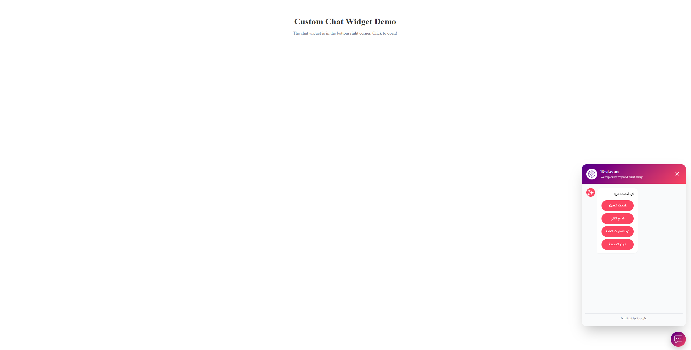

# LiveChat



---

LiveChat is a real-time interactive chat project built with [Angular CLI](https://github.com/angular/angular-cli). It can be integrated directly with an n8n workflow.

---

## ⚡️ Quick Notes

* There is an **n8n.json** file included with the project. You can upload it to n8n to get the exact same workflow ready to use.
* After creating any new workflow in n8n, click the **three dots (···)** at the top of the workflow page, then select **"Import from File..."** and upload the `n8n.json` file from this project. This will instantly create the same workflow for you—no manual setup needed!
* You can run n8n locally using Docker, or use n8n Cloud. Node.js is required to run Angular locally.

---

## 🐳 Starting n8n

From your terminal, run:

```bash
docker volume create n8n_data

docker run -it --rm --name n8n -p 5678:5678 -v n8n_data:/home/node/.n8n docker.n8n.io/n8nio/n8n
```

Then open [http://localhost:5678](http://localhost:5678) to access the n8n interface.

---

## ▶️ Starting Angular Project

Make sure Node.js is installed, then:

```bash
npm install
ng serve
```

Open [http://localhost:4200](http://localhost:4200)

---
